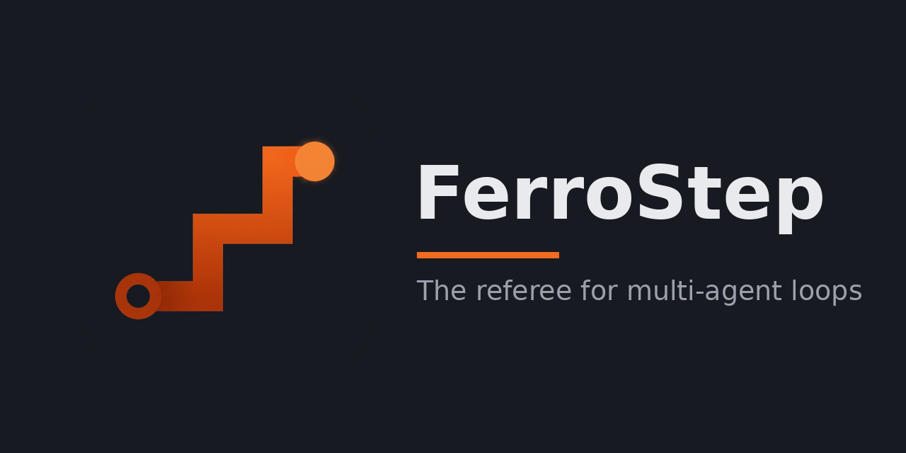

<p align="center">
  
</p>

# FerroStep

**A data-driven state-machine referee for multi-agent loops, with the ledger in
your database — not in a framework's graph object.**

FerroStep is for teams running LLM agents against real work — developer/reviewer
loops, generate/QC pipelines, escalation paths — who want the loop's *rules*
(who may move what where, and how many passes before a human is called) defined
once, validated, and applied consistently, while keeping prompts, network
calls, and agent runtimes in their own language and stack.

Instead of hiding orchestration state inside an in-memory graph, FerroStep
treats a store you already run as the single source of truth — relational,
document or embedded key-value; a record is an object, and how it is stored is
the adapter's business. Every record carries a `state` and its counters; the
engine is a pure function that answers one question:

> *May this role move this record to that state — and what does that cost?*

Your application reads a record, asks the engine, and persists what the
decision instructs. The runtime stays stateless, crash-recovery is "read the
ledger", and the state stays in something you can open — a database browser
where your store has one, and never a framework's private checkpoint format.

## What the engine guarantees

The core encodes lessons from running real agent loops in production:

- **Workflows are data, not code.** A definition is JSON (states, roles,
  transitions, counters), validated structurally at load time — unknown states,
  dead ends, exits from terminal states, and a pause nobody can release all
  fail before the first record moves.
- **Loop ceilings priced so a crash still costs.** Counters spend on *entry*
  to work (claiming a pass costs it), so an agent that crashes mid-pass has
  already paid, and the engine never hands back a budget the work did not
  finish spending. Persist the state flip and the spend in one write and a
  crash loop cannot become an infinite loop — split them and it can, which is
  why they come back in a single decision.
- **Exhaustion is routing, not an error.** When a ceiling is spent the engine
  answers with the state to route to instead — typically escalate-to-human.
- **An ending and a pause are different things.** A `terminal` state is final
  and nothing ever leaves it. A `halted` state stops automation but must
  declare a way back, and only a role marked `human` may take it. So "does
  this record need a person?" is read from the definition rather than guessed
  at — and a ceiling cannot strand work somewhere nobody can reach.
- **Role-gated transitions.** "The worker never closes an issue; the reviewer
  resolves what it verifies" is expressible — and checked — per transition.
- **A move that exists and a move that would fire are different facts.** Asking
  what a role may do next returns each option with what it would actually do
  right now, so a surface can never offer a person a button that quietly routes
  the record elsewhere. It also names the condition no state can show you: every
  remaining move spent, nothing stopping automation from *trying*, and the work
  reading as healthy until someone does.
- **Counters belong to the operator.** The engine spends them and never
  corrects them; it clears one only where a transition's `resets` says to,
  which is the operator's own instruction and comes back in the same decision
  as the state move, so the ledger takes both or neither.
- **Purpose travels with the definition.** An optional, engine-opaque
  `purpose` field names why the loop exists (or points at the document that
  does — a north-star file, a mission statement), so review-role actors can be
  briefed from a stated source instead of tribal knowledge. The engine carries
  it and never interprets it.

## What FerroStep is not

It is honest about its position in your stack: the engine is *consulted*, not
in the write path. A buggy caller could skip it and write state directly —
hard enforcement belongs in whatever your store can enforce for itself —
row-level security, API rules, a hook, a constraint — where it can enforce
anything at all. Emitting that from the same `WorkflowDef` is on the roadmap. FerroStep gives you a single,
tested, shared implementation of the loop logic across every language in your
stack; your database gives you the lock.

## The gap this fills

Neighboring tools each want to **be the loop**: agent runtimes (PydanticAI,
smolagents) are the *actors*; graph frameworks (LangGraph) host every actor
inside their runtime; durable execution (Temporal, DBOS) resumes *a crashed
program* — but a loop whose actors are independent processes and a human
editing the database has no single program to resume; in-process state
machines (Apache Burr) referee an application that owns them. FerroStep is the
piece none of them ship: a **referee, not a runtime** — the ledger owns the
loop, and every actor, human included, is just a client of the truth.
[`docs/prior-art.md`](docs/prior-art.md) works this through tool by tool
against eight concrete requirements, and says honestly when to use the others
instead.

## Example: a worker/reviewer rework loop

```json
{
  "name": "review-loop",
  "roles": ["worker", "reviewer", { "name": "operator", "human": true }],
  "states": ["awaiting_worker", "working", "awaiting_review", "approved", "escalated"],
  "initial": "awaiting_worker",
  "terminal": ["approved"],
  "halted": ["escalated"],
  "counters": [{ "name": "agent_passes", "max": 3, "on_exhausted": "escalated" }],
  "transitions": [
    { "from": "awaiting_worker", "to": "working", "role": "worker", "spends": ["agent_passes"] },
    { "from": "working", "to": "awaiting_review", "role": "worker" },
    { "from": "awaiting_review", "to": "awaiting_worker", "role": "reviewer" },
    { "from": "awaiting_review", "to": "approved", "role": "reviewer" },
    { "from": "awaiting_review", "to": "escalated", "role": "reviewer" },
    { "from": "working", "to": "awaiting_worker", "role": "operator" },
    { "from": "escalated", "to": "awaiting_worker", "role": "operator", "resets": ["agent_passes"] }
  ]
}
```

A role is a bare string until it needs an attribute. `escalated` is a pause
rather than an ending, so the definition has to say who releases it and what
that costs — here the operator, clearing the ceiling on the way out.

From Python:

```python
from ferrostep import Engine

engine = Engine(workflow)          # ValueError here if the definition is broken

decision = engine.authorize(
    state="awaiting_worker", counters={"agent_passes": 2},
    role="worker", to="working",
)
# {'kind': 'allow', 'to': 'working', 'counter_updates': {'agent_passes': 3}}
# Persist the flip AND the counter update in ONE atomic write.

decision = engine.authorize(
    state="awaiting_worker", counters={"agent_passes": 3},
    role="worker", to="working",
)
# {'kind': 'exhausted', 'to': 'escalated', 'counter': 'agent_passes'}
# The loop is spent: route the record to a human instead.
```

The same loop runs from Rust via `ferrostep-core` directly.

More shapes — including a product-alignment review whose ledger record is the
product itself at a point in time — live in [`examples/`](examples/). They are
illustrations, never standards: FerroStep ships **no canonical workflow**, and
the engine knows nothing about any particular one. Fluid configuration is the
product; the configurations are yours.

## Running a loop on it

The engine decides. Everything else here carries a decision to a store, and a
person to the decision — each piece an adapter, and each one optional.

**The ledger is a store you already run.** Two adapters ship as maintained
defaults, and being the worked example somebody copies to write a third is
part of the job.

- **SQLite** — the zero-install path: one WAL-mode file, no server, no
  account. Every actor is a separate process on one host, which is exactly
  the case WAL supports. ⚠ And exactly where it stops: a database file on a
  network share is corruption waiting, not a small-team deployment.
- **PocketBase** — a stock instance plus a generated migration and
  transactional routes. It can referee its own collections, or *map* onto a
  collection you already have, so the store's console stays the human view of
  the one truth.

An adapter states what it **cannot** promise as readily as what it can:
atomic apply, compare-and-swap and append-only history are per-store facts,
not interface-wide ones, and an audit implying more than the store delivers
is worse than one that admits the gap.

**A person decides from the `ferrostep` binary.**

```sh
ferrostep file --workflow loop.json --store sqlite:loop.db \
  --role reviewer --scope branch=main --note "found in the release audit"

ferrostep awaiting --workflow loop.json --store sqlite:loop.db
ferrostep awaiting --workflow loop.json --store sqlite:loop.db --role reviewer

ferrostep move --workflow loop.json --store sqlite:loop.db \
  --record 42 --role operator --to awaiting_worker \
  --note "reproduced locally; worth another pass"
```

`file` starts a loop — it is how a record gets into a store that has no
console of its own, which is the zero-install path's whole situation.
`awaiting` lists what is waiting and what each available move would
*actually* do right now — by default the records that need a **person**, and
with `--role` the queue of any one actor, including a non-human one.

⚠ **That flag is not a convenience.** Without it the question is "does a
person need to act", which cannot see a record handed from one agent to
another: it is `Live`, and `Live` says *some* automated role can act without
saying which. In a worker/reviewer loop that handover is the ordinary case,
so a reviewer finishing and passing work back raises nothing at all unless
somebody asks whose turn it is.

`move` resolves one without opening a database
console. `audit` reports what happened — moves, escalations, releases, the
last note — reading the same enumeration `awaiting` does, so the two views
cannot disagree. `notify` sends one message per awaiting record through the
notifier adapter; nothing here polls or schedules, so a caller decides when.

⚠ **Filing is default-deny and its ceiling is yours to measure.** A
definition that does not say who may file grants it to nobody. And where
filing spends a counter, that counter bounds a *population* — how much work a
branch or a cycle may create — so it belongs to whatever can count it, never
to the record being filed; pass it with `--counter name=value` and the binary
will refuse rather than assume a zero. Some deployments keep filing for
themselves: a *mapped* PocketBase collection refuses it by name, so the
procedure that already creates those records stays the one that does.

**A graded attribute is an ordered ladder the definition controls.** Where a
lane keys a decision on a value — a severity, a priority, a confidence —
`ferrostep grade` moves it through the referee, and the definition says who may
move it **in each direction**. ⚠ **The engine has no opinion about which
direction is dangerous**, and that is deliberate: *raising is safe* is true of
a gate that blocks at or above a floor and exactly backwards for one requiring
a minimum, so nothing is inferred and no threshold is modelled. Order comes
from the ladder's position, never the value's name.

**`doctor` asks whether a definition is satisfiable against a store** —
before a transition proves it is not. Are the definition's states values the
state column will accept? Are its ladders' values ones the graded columns will
accept? Do its counters and scope labels have columns? Can the *installed*
write path reach them? Read-only, and explicit rather than
automatic: run it when a definition changes. ⚠ **A question it could not
answer exits non-zero, exactly like a fault.** A gate that passes because it
could not look is the failure this exists to remove — and the report counts
and shows what it *did* verify, because a run that checked nothing also has no
complaints.

⚠⚠ **A generated file outlives the binary that wrote it, so upgrading this
crate can leave a deployment behind.** The hooks installed in a store were
written by whatever version generated them; a newer adapter meeting an older
file is the ordinary case, not the exotic one. Where that matters, the file is
built to **say what it can do** and the adapter refuses what it cannot reach —
never to accept, drop, and answer success. So after upgrading, regenerate the
generated files and reinstall them; `doctor` reports every question it could
not ask as *unchecked* and **exits non-zero**, which is what a stale install
looks like from the outside. ⚠ A refusal there is the correct behaviour and
not a broken state: nothing has been mis-checked, and nothing was checked.

`explain` takes no store at all. Besides who may file, what may move where,
and who may change a scope label, it prints the numbers the definition
asserts **and their off-by-one neighbours** — the list you want when a
ceiling moves into a definition and the arithmetic derived from it stays
behind in a guard, a help string, or a brief handed to an agent. A search for
the ceiling finds none of those.

**Scope is which unit of work a record belongs to** — a branch, a cycle, a
tenant. Every query that finds work filters on it, so a record whose scope
names a finished unit is invisible to all of them. Moving one is therefore a
refereed operation rather than a field edit: `ferrostep rescope` performs it,
a definition grants it per label and per role or nobody has it, and it lands
versioned and evented like any other move. ⚠ Refused on a finished record,
and that is not configurable — a terminal record's scope is the provenance of
what it was resolved against.

**The roster answers the other half of an actor's question.** The engine says
what may be done; a `config.yaml` says who is doing it — each agent's title,
the identity its work is signed under, and the persona document a launcher
hands it. `ferrostep agent-env` reads it, and takes neither a workflow nor a
store, because who the actors are is knowable without one.

## Layout

| crate | what |
|---|---|
| `ferrostep-core` | Pure Rust engine: definitions, validation, decisions. No IO, no async, no database. |
| `ferrostep-ledger` | The interface a ledger adapter implements, and the capabilities it has to state honestly. Holds no IO of its own. |
| `ferrostep-sqlite` | SQLite adapter, and the zero-install path: one WAL-mode file on one host. |
| `ferrostep-pocketbase` | PocketBase adapter: a stock instance plus the migration and transactional routes it generates. |
| `ferrostep-notify` | The notification — which record, why, how urgently, how to get back — and the `Notifier` boundary it is delivered through. ntfy is the maintained default. |
| `ferrostep-roster` | Who the actors are: title, the identity work is signed under, and the persona document a launcher hands them. |
| `ferrostep-cli` | The `ferrostep` binary: the decision surface, the moves that resolve it, the audit, the notify wiring, and the roster reader. |
| `ferrostep-py` | PyO3/maturin bindings; installs as the `ferrostep` Python package. |
| `ferrostep-github` | Represents an agent roster to GitHub as a GitHub App; today it emits the registration manifest ([roadmap](docs/github-agents-roadmap.md)). |

TypeScript bindings (NAPI-RS) are planned and the workspace leaves room for
them; they land when there is a TypeScript consumer to drive their API.

[`docs/deployment-map.md`](docs/deployment-map.md) records what ships through
which channel, and what never leaves the repo.

## Building

```sh
cargo test --workspace                # engine, adapters, CLI
cargo install --path ferrostep-cli    # the `ferrostep` binary

# Python bindings (uses uv; any PEP-517 installer works)
uv venv && uv pip install ./ferrostep-py pytest
.venv/bin/pytest ferrostep-py/tests
```

The PocketBase adapter's live end-to-end and concurrency tests are
`#[ignore]` by default; they need a real instance and are run against one
deliberately.

## Roadmap

[`docs/ROADMAP.md`](docs/ROADMAP.md) is the roadmap of record. In one breath:
prove the referee on one real loop (two baseline ledger adapters, a surface a
human can decide from, and notifications that reach them), then compile
enforcement into the database itself, then expand by demand — the
GitHub surface ([`docs/github-agents-roadmap.md`](docs/github-agents-roadmap.md)),
more backends, more languages — until the engine referees its own
development.

## License

Apache-2.0. Copyright 2026 Artificial Humanity LLC.
